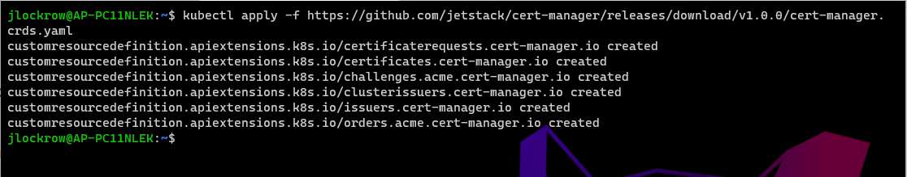
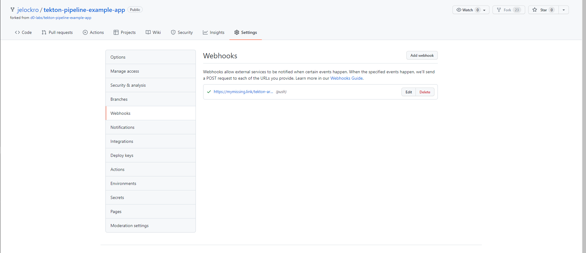

# 2021-DigitalOcean-K8s-Challenge: Project: Native Build & Release Pipelines with Tekton and ArgoCD

## About me ##
I'm a Cloud Automation Team Lead that's trying to get more experience working with Kubernetes clusters and CI/CD.  


# Provisioning a Kubernetes cluster on Digital Ocean ##
In Digital Ocean console, create a new project. I have named mine k8-challenge.


Now it is time to create a cluster. 


I left the Kubernetes version at its default (1.21.5-do.0 at the time of this writing).

I selected the San Francisco datacenter.

VPC Network was left as default.

I made a couple adjustments to cluster capacity, as this is a learning exercise for me.
1. Node plan: $20/month plan (2.5 GB RAM, 2 vCPU per node)
2. 3 node total


Finalize with naming your cluster and adding tags, and selecting the project you want your cluster to be part of.  I left the default name, but I did add the tag cicd.


After clicking finalize, scroll down a bit to the overview. Continue to the 'Connecting to Kubernetes section.'  

I just want to draw attanetion to the 'Manual' tab for instuctions to test your connectiviy. I prefer to reduce dependencies and stay as cloud-agnostic as possible, so this tutorial will be using kubectl over doctl.   

You can follow the instruction on this tab if you want to, but we are going to do all of this in later steps. Click Continue.


Do whatever you want with the Patch & minor upgrades. I checked the box and left the default upgrade window. Click Continue. 


Don't install any apps for this tutorial. Click Continue.


Don't install any apps for this tutorial. Click Continue.


Great your done! Click the big blue button.


Now we are going to download the config file.


# Installing kubectl, helm, & k9s
This tutorial only supports WSL.  If you are on a mac or linux box, this will all be easier and there are plenty of tutorials out there, but I am on a Windows machine.

### WSL 
I chose to use WSL since my work laptop is Windows.  

### Install kubectl
```
    curl -LO "https://dl.k8s.io/release/$(curl -L -s https://dl.k8s.io/release/stable.txt)/bin/linux/amd64/kubectl"

    curl -LO "https://dl.k8s.io/$(curl -L -s https://dl.k8s.io/release/stable.txt)/bin/linux/amd64/kubectl.sha256"
    echo "$(<kubectl.sha256)  kubectl" | sha256sum --check
```    


    sudo chmod +x kubectl
    mkdir -p ~/.local/bin/kubectl
    
    mv ./kubectl ~/.local/bin/kubectl
    
    kubectl version --client


### Install helm
```
curl -fsSL -o get_helm.sh https://raw.githubusercontent.com/helm/helm/main/scripts/get-helm-3
chmod 700 get_helm.sh
./get_helm.sh
```
I already had Helm installed so my screenshots won't be so helpful.

### Install k9s
```
curl -sS https://webinstall.dev/k9s | bash

```


# Connecting to you cluster 

Assuming you are following along on a windows machine, when you downloaded the config file earlier it is in you user's Download file. 

While using WSL, we will enter that directory. Of course your username and the name of your configuration file will be differnt, but here are the commnads I used.

    cd /mnt/c/Users/jlockrow/Downloads

    kubectl --kubeconfig="k8s-1-21-5-do-0-sfo3-1640635833119-kubeconfig.yml" get nodes


Since I only have this one cluster, I will just copy the configuration file in the earlier step into the  ~/.kube directory. 
    cd ~

    cp /mnt/c/Users/jlockrow/Downloads/k8s-1-21-5-do-0-sfo3-1640877980149-kubeconfig.yaml ~/.kube/config
And make sure that kubectl is using your configuration.

    kubectl get nodes


# Get a Domain
It doesn't matter what service you use.  I used AWS.  A .link domain is only 5.00. I will not be going through all the steps to register a domain with AWS. Just make sure you provide a valid email address.  You will need this email address later in the tutorial.


# Installing Ambassador, ArgoCD and Tekton on Kubernetes

## Installing Ambassador
I followed this tutorial by Adri Villela from Dzer Labs:
https://medium.com/dzerolabs/installing-ambassador-argocd-and-tekton-on-kubernetes-540aacc983b9

### 1- Install Ambassador >= v.1.7.3
This is a big chuck of commands, but it should work fine. There will be afew rbac.authorization warnings that you can ignore...at least I did. It takes a little longer for the ambassador-redi condigion to be met, so be patient.

```
kubectl apply -f https://www.getambassador.io/yaml/aes-crds.yaml && kubectl wait --for condition=established --timeout=90s crd -lproduct=aes && kubectl apply -f https://www.getambassador.io/yaml/aes.yaml && kubectl -n ambassador wait --for condition=available --timeout=90s deploy -lproduct=aes

```
You want the last few lines to look like this:


I have changed the next step a bit from the tutorial, so that you echo out the actual ip address: 

    AMBASSADOR_IP=$(kubectl get -n ambassador service ambassador -o "go-template={{range .status.loadBalancer.ingress}}{{or .ip .hostname}}{{end}}") && echo $AMBASSADOR_IP


Use that ip address in your browser to see the fancy penguin. (Remember! The ip in the screenshots is from my cluster, yours will be different )


### 2- Install Cert-Manager v1.0.0

```
kubectl apply -f https://github.com/jetstack/cert-manager/releases/download/v1.0.0/cert-manager.crds.yaml
```


```
helm repo add jetstack https://charts.jetstack.io && helm repo update
```


```
kubectl create ns cert-manager
```


```
helm install cert-manager --namespace cert-manager jetstack/cert-manager
```


### 3 - Get the public IP address your ingress controller
```
IP=$(kubectl get -n ambassador service ambassador -o "go-template={{range .status.loadBalancer.ingress}}{{or .ip .hostname}}{{end}}")
echo $IP
```


### 4 - Add the public ingress controller ip to the AWS A record.


### 4 - See if it works!


### 5 - Configure TLS on Ambassador
This is the time where I like to begin working in a worskpace directory, so I can nuke everything when I'm done.  

If you want to follow the same practice you can set it up like this:
```
mkdir -p ~/workspace/k8-challenge-cicd
cd ~/workspace/k8-challenge-cicd
```
Download the file from adri's githup:

```
curl -o ambassador-tls-cert-issuer.yml https://gist.githubusercontent.com/avillela/d220ad085502eb475ab6415b8b4ad208/raw/9ec0ec606b2aca71a5cff1fc3b38301c9dfc090e/ambassador-tls-cert-issuer.yml
```
And edit it with your favorite editor.
Change all the values in <> brackets. 

**!! IMPORTANT !!**
 The Email you add must be the email that you registered your domain with!

For example, this is what I did..but that is not my email:
```
...
spec:
  acme:
    email: jelockro@myemail.com

...
  dnsNames:
  # Replace this with the FQDN value
  - mymissing.link
```

```
---
apiVersion: cert-manager.io/v1
kind: ClusterIssuer
metadata:
  name: letsencrypt-prod
spec:
  acme:
    email: <you@address.com>
    server: https://acme-v02.api.letsencrypt.org/directory
    privateKeySecretRef:
      name: letsencrypt-prod
    solvers:
    - http01:
        ingress:
          class: nginx
      selector: {}

---
apiVersion: cert-manager.io/v1
kind: Certificate
metadata:
  name: ambassador-certs
  # cert-manager will put the resulting Secret in the same Kubernetes 
  # namespace as the Certificate. You should create the certificate in 
  # whichever namespace you want to configure a Host.
  namespace: ambassador
spec:
  secretName: ambassador-certs
  issuerRef:
    name: letsencrypt-prod
    kind: ClusterIssuer
  dnsNames:
  # Replace this with the FQDN value
  - <my_fqdn_replace_me>

---
apiVersion: getambassador.io/v2
kind: Mapping
metadata:
  name: acme-challenge-mapping
  namespace: ambassador
spec:
  prefix: /.well-known/acme-challenge/
  rewrite: ""
  service: acme-challenge-service

---
apiVersion: v1
kind: Service
metadata:
  name: acme-challenge-service
  namespace: ambassador
spec:
  ports:
  - port: 80
    targetPort: 8089
  selector:
    acme.cert-manager.io/http01-solver: "true"
```
save the file and run:
```
kubectl apply -f ambassador-tls-cert-issuer.yml

```

Make sure everything is good:
```
kubectl get pods -n cert-manager
```


Check the certificate:
```
kubectl describe certificates ambassador-certs -n ambassador

```
Hopefully you will see this.  If you don't, there is a problem with your regiesterd domain.  Best of luck!


Next, check to make sure that your secrets have been created:
```
kubectl get secrets -n ambassador
```


Now download the service and loadbalance yaml:
```
 curl -o ambassador-tls-ambassador-service.yml https://gist.githubusercontent.com/avillela/d88d8bfc117e6451ac4f488531a034de/raw/11278e1bd5fb3569a6ef75e9285f85a67bead094/ambassador-tls-ambassador-service.yml
```
Now to get the lock, you will have to edit this above what the tutorial suggests, so that there is no http traffic at all, by removing lines 22-25.

From this:


To This:


Now apply the file:
```
kubectl apply -f ambassador-tls-ambassador-service.yml

```
And hopefully you see this beautiful thing:


## Install ArgoCD v1.7.6

### 1 - Install ArgoCD
Run this one-liner block:
```
kubectl create namespace argocd && kubectl apply -n argocd -f https://raw.githubusercontent.com/argoproj/argo-cd/v1.7.6/manifests/install.yaml
```


### 2 - Expose ArgoCD with Ambassador

Download the .yaml:
```
curl -o argocd-ambassador.yml https://gist.githubusercontent.com/avillela/a78e0422db4f5257e6f523b37bafe1dd/raw/fd9d03ed7c78285d2011e48de4f21d0eae999447/argocd-ambassador.yml
```
And Apply it (no edits necessary):
```
kubectl apply -f argocd-ambassador.yml
```


In your browser go to your https:<your-domain.whatever>/argo-cd, and you should see this lovely octopus:


### 3 - Install the ArgoCD CLI
I did not find the instructions helpful on the argo-cd website.  Try these:
```
curl -sSL -o argocd https://github.com/argoproj/argo-cd/releases/latest/download/argocd-linux-amd64

sudo chmod +x argocd
mkdir -p ~/.local/bin/argocd
mv ./argocd ~/.local/bin/argocd/argocd

```
Validate it by running:
```
argocd version
```


### 4 - change the admin password, and login to ArgoCD

Go Here:
https://bcrypt-generator.com/ and enter your password and click encrypt.  Copy the output.


Copy the string into the value for "admin.password" as shown here:
```
kubectl -n argocd patch secret argocd-secret \
  -p '{"stringData": {
    "admin.password": "$2a$12$iVG1Dny/bQ7SYeRRehZr2ObYio3UFHFCzMG29cZlwKY8kCOvllEhK",
    "admin.passwordMtime": "'$(date +%FT%T%Z)'"
  }}'
```
And patch the password by running the command:


Now login using the PLAINTEXT passwor (replace the url with your domain):
```
argocd login mymissing.link --grpc-web-root-path /argo-cd
```

As you saw earlier my plaintext password was "password", your is likely different:


## Install Tekton v0.16.0 and Tekton Triggers v0.8.1

### 1 - Install tekton & Tekton triggers
```
kubectl apply -f https://storage.googleapis.com/tekton-releases/pipeline/previous/v0.16.0/release.yaml

kubectl apply -f https://storage.googleapis.com/tekton-releases/triggers/previous/v0.8.1/release.yaml
```
### 2 - Configure persistent volume for Tekton

```
kubectl create configmap config-artifact-pvc \
--from-literal=size=10Gi \
--from-literal=storageClassName=manual \
-o yaml -n tekton-pipelines \
--dry-run=true | kubectl replace -f -
```
You will see a deprecation warning. That's okay.


## YOU DID IT.  
**Standup and Stretch and Move Around!**

You are almost Done. This last part can get hairy.  So take a break, get a snack or something.

# Build a Kubernetes-Native Build & Release Pipelines with Tekton and ArgoCD

We will now be following this other tutorial also writen by Adri Villela:  [Kubernetes-Native Build & Release Pipelines with Tekton and ArgoCD](https://medium.com/dzerolabs/using-tekton-and-argocd-to-set-up-a-kubernetes-native-build-release-pipeline-cf4f4d9972b0)

## Setup Github by forking, cloning, and creating webhooks

### 1 -Fork Repositories
Click on links, and fork these repositories:

[Tekton Pipeline Repo](https://github.com/d0-labs/tekton-pipeline-example-pipeline)

[Example App Repo (a Dockerized 2048 game)](https://github.com/d0-labs/tekton-pipeline-example-app)

### 2- Clone your forks
Replace \<username\> with your github username and clone your forks:
```
git clone https://github.com/<username>/tekton-pipeline-example-app.git

git clone https://github.com/<username>/tekton-pipeline-example-pipeline.git
```

### 3 - Create a Webhook for the Tekton Pipeline

The Webhook URL look something like this:
https://\<cluster_url\>/tekton-argocd-example-build-mapping/



Make sure that you change the 'Content type' to application/json and click the radio button to Enable SSL verification.


If you forget to enter 'https' or have some problem, you can click on Recent Deliveries.  Make sure you have a sucessful delivery.


## Setup ArgoCD to interact with github and dockerhub

### 1- Create secrets
You will need to create the following secrets in the tekton-pipeline/resources/secrets folder:
a) argocd_secrets.env
```
ARGOCD_USERNAME=admin
ARGOCD_PASSWORD=password
```
b) docker_secrets.env

This is what I had, yours will differ. By the way, this password token won't actually work on my hub.
```
username=jelockro
password=ce74qwerqw-fsdf7-400d-891d-b5asdfd38932db
```
c) git_app_secrets.env

You’ll need to generate a personal access token (PAT). This tutorial is using github.
Go to settings by clicking on the arrow next to your user icon in the top right.

]


Click on Developer Settings
]

Generate a new Personal Access Token.


Once you’ve generated the PAT, enter them in the git_app_secrets.env file:
```
username=jelockro
password=as;dlfkj_qoi34-987asdfijasdlkfjkjhasdf
```
(Again, above is not an actual PAT)

### 2- Update ArgoCD Task ConfigMaps

update line 7 of file argocd-task-cm.yml from the tekton-pipeline-example-pipeline repo to include your server.  Do not include 'http' or 'https'. See what I've done:


### 3- Update resource URLs
This one really hung me up.  In secrets.yml of the tekton-pipeline-example-pipeline repo, replace the git docker registry information. Pay attention to the syntax for what I've done specifically for github and docker.


### 4- Update Triggers
Replace <json_resource_repo_url_path> with the path to the JSON resource pointing to your Git repo URL. 


Replace <docker_registry_name> with your Docker registry’s name


## Create the Pipeline

### 1- Create your Tekton pipeline namespace and secrets

Before running the following command, make sure your present working directory is the top level directory of the tekton-pipeline-example-pipeline repo you cloned:
```
kubectl apply -k tekton-pipeline/resources/.

```


### 3- Register the two repos with ArgoCD
Run these commands, replacing your username and password token for github:
```
export SCM_USERNAME=<git_repo_username>
export SCM_PAT=<git_repo_personal_access_token>
```


Remember to change the repo to your repo, and run this command:
```
argocd repo add https://github.com/jelockro/tekton-pipeline-example-pipeline --username $SCM_USERNAME --password $SCM_PAT

argocd repo add https://github.com/jelockro/tekton-pipeline-example-app --username $SCM_USERNAME --password $SCM_PAT
```


If successful you should see this when clicking on the gears on the left and then clicking 'Repositories':


### 4- Create the ArgoCD pipeline Application
change your repor below, but keept the --dest-server and --dest-namespace the same.
```
argocd app create tekton-pipeline-app --repo https://github.com/jelockro/tekton-pipeline-example-pipeline --path tekton-pipeline --dest-server https://kubernetes.default.svc --dest-namespace tekton-argocd-example
```


### 5- Create the ArgoCD app for the 2048 game

```
argocd app create 2048-game-app --repo https://github.com/jelockro/tekton-pipeline-example-app --path kustomize --dest-server https://kubernetes.default.svc --dest-namespace game-2048 --sync-option CreateNamespace=true

```


## 6- Sync (deploy) the Tekton pipeline

Now it's time to run k9's in a separate terminal.

```
k9s
```


```
argocd app sync tekton-pipeline-app --prune
```


## 8- Make a change to your app repo, and let ‘er rip!

update depolyment.yml which is in the kustomize directory so that it point to your docker registry. Like so: 


Now, let's see what happens when we commit by watching k9s. Also, I use this one-liner to commit and push to save time
```
git add . && git commit -m 'testing' && git push origin main
```

Congratulations!!